# 🔐 Laboratorio OAuth2 Completo

## Desarrollo Seguro de Aplicaciones .NET en Azure

---

## 📋 Índice

1. [Introducción a OAuth2](#introducción-a-oauth2)
2. [Conceptos Fundamentales](#conceptos-fundamentales)
3. [Flujos de Autorización](#flujos-de-autorización)
4. [Implementación en .NET 9](#implementación-en-net-9)
5. [Azure AD y OAuth2](#azure-ad-y-oauth2)
6. [Configuración Práctica](#configuración-práctica)
7. [Análisis de Tokens](#análisis-de-tokens)
8. [Mejores Prácticas de Seguridad](#mejores-prácticas-de-seguridad)
9. [Troubleshooting](#troubleshooting)
10. [Recursos Adicionales](#recursos-adicionales)

---

## 🎯 Introducción a OAuth2

### ¿Qué es OAuth2?

OAuth2 (Open Authorization 2.0) es un framework de autorización que permite a las aplicaciones obtener acceso limitado a cuentas de usuario en servicios HTTP, como Facebook, Google, Microsoft, etc.

### ¿Por qué usar OAuth2?

- **Seguridad**: Los usuarios no comparten sus credenciales con aplicaciones de terceros
- **Flexibilidad**: Permite diferentes niveles de acceso (scopes)
- **Escalabilidad**: Estándar ampliamente adoptado
- **Experiencia de usuario**: Single Sign-On (SSO)

### Diferencias con OpenID Connect

- **OAuth2**: Framework de **autorización** (¿qué puede hacer?)
- **OpenID Connect**: Capa de **autenticación** sobre OAuth2 (¿quién es?)

---

## 🔑 Conceptos Fundamentales

### Roles en OAuth2

#### 1. **Resource Owner** (Propietario del Recurso)

- **Quién es**: El usuario final
- **Qué hace**: Autoriza el acceso a sus recursos
- **Ejemplo**: Un usuario que permite a una app acceder a su perfil de Microsoft

#### 2. **Client** (Cliente)

- **Qué es**: La aplicación que solicita acceso
- **Tipos**:
  - **Confidential**: Puede mantener secretos (apps web)
  - **Public**: No puede mantener secretos (apps móviles/SPA)
- **Ejemplo**: Nuestra aplicación .NET MVC

#### 3. **Resource Server** (Servidor de Recursos)

- **Qué es**: El servidor que aloja los recursos protegidos
- **Función**: Acepta y responde a solicitudes con tokens
- **Ejemplo**: Microsoft Graph API

#### 4. **Authorization Server** (Servidor de Autorización)

- **Qué es**: Emite tokens de acceso
- **Función**: Autentica al usuario y autoriza al cliente
- **Ejemplo**: Azure AD

### Tokens en OAuth2

#### Access Token

```json
{
  "aud": "api://myapp-12345",
  "iss": "https://login.microsoftonline.com/tenant-id/v2.0",
  "exp": 1699891200,
  "scope": "user.read mail.read",
  "sub": "user-unique-id"
}
```

#### Refresh Token

- **Propósito**: Obtener nuevos access tokens sin re-autenticación
- **Vida útil**: Más larga que los access tokens
- **Seguridad**: Debe almacenarse de forma segura

---

## 🌊 Flujos de Autorización

### 1. Authorization Code Flow (Recomendado)

```mermaid
sequenceDiagram
    participant User as Usuario
    participant Client as Cliente (.NET App)
    participant AuthServer as Azure AD
    participant ResourceServer as Microsoft Graph

    User->>Client: 1. Iniciar sesión
    Client->>AuthServer: 2. Redirigir a /authorize
    AuthServer->>User: 3. Mostrar login
    User->>AuthServer: 4. Credenciales
    AuthServer->>Client: 5. Código de autorización
    Client->>AuthServer: 6. Intercambiar código por tokens
    AuthServer->>Client: 7. Access + Refresh tokens
    Client->>ResourceServer: 8. Llamada API con token
    ResourceServer->>Client: 9. Respuesta con datos
```



#### Ventajas:

- ✅ Más seguro (código temporal)
- ✅ Soporte para refresh tokens
- ✅ Ideal para aplicaciones web

#### Implementación en .NET:

```csharp
// Program.cs
builder.Services.AddAuthentication(OpenIdConnectDefaults.AuthenticationScheme)
    .AddMicrosoftIdentityWebApp(builder.Configuration.GetSection("AzureAd"))
    .EnableTokenAcquisitionToCallDownstreamApi()
    .AddMicrosoftGraph(builder.Configuration.GetSection("MicrosoftGraph"))
    .AddInMemoryTokenCaches();
```

### 2. Authorization Code Flow with PKCE

PKCE (Proof Key for Code Exchange) añade una capa extra de seguridad:

```csharp
// Generación de PKCE
private static string GenerateCodeVerifier()
{
    var bytes = new byte[32];
    RandomNumberGenerator.Fill(bytes);
    return Convert.ToBase64String(bytes)
        .TrimEnd('=')
        .Replace('+', '-')
        .Replace('/', '_');
}

private static string GenerateCodeChallenge(string verifier)
{
    var bytes = SHA256.HashData(Encoding.UTF8.GetBytes(verifier));
    return Convert.ToBase64String(bytes)
        .TrimEnd('=')
        .Replace('+', '-')
        .Replace('/', '_');
}
```

### 3. Implicit Flow (Depreciado)

⚠️ **No recomendado** para aplicaciones nuevas debido a problemas de seguridad.

### 4. Client Credentials Flow

Para aplicaciones que acceden a recursos sin un usuario:

```csharp
// Para aplicaciones daemon/background
var app = ConfidentialClientApplicationBuilder
    .Create(clientId)
    .WithClientSecret(clientSecret)
    .WithAuthority(authority)
    .Build();

var result = await app.AcquireTokenForClient(scopes).ExecuteAsync();
```

---

## 💻 Implementación en .NET 9

### Configuración Inicial

#### 1. Paquetes NuGet

```xml
<PackageReference Include="Microsoft.Identity.Web" Version="3.2.0" />
<PackageReference Include="Microsoft.Identity.Web.UI" Version="3.2.0" />
<PackageReference Include="Microsoft.Graph" Version="5.36.0" />
<PackageReference Include="Microsoft.Graph.Authentication" Version="2.1.0" />
```

#### 2. appsettings.json

```json
{
  "AzureAd": {
    "Instance": "https://login.microsoftonline.com/",
    "Domain": "tu-dominio.onmicrosoft.com",
    "TenantId": "tu-tenant-id",
    "ClientId": "tu-client-id",
    "ClientSecret": "tu-client-secret",
    "CallbackPath": "/signin-oidc",
    "SignedOutCallbackPath": "/signout-callback-oidc"
  },
  "MicrosoftGraph": {
    "BaseUrl": "https://graph.microsoft.com/v1.0",
    "Scopes": "user.read mail.read"
  }
}
```

#### 3. Program.cs Completo

```csharp
using Microsoft.AspNetCore.Authentication.OpenIdConnect;
using Microsoft.Identity.Web;
using Microsoft.Identity.Web.UI;

var builder = WebApplication.CreateBuilder(args);

// Configurar autenticación con Azure AD
builder.Services.AddAuthentication(OpenIdConnectDefaults.AuthenticationScheme)
    .AddMicrosoftIdentityWebApp(builder.Configuration.GetSection("AzureAd"))
    .EnableTokenAcquisitionToCallDownstreamApi()
    .AddMicrosoftGraph(builder.Configuration.GetSection("MicrosoftGraph"))
    .AddInMemoryTokenCaches();

// Configurar autorización
builder.Services.AddAuthorization(options =>
{
    options.FallbackPolicy = options.DefaultPolicy;
});

// Agregar MVC y UI de Identity
builder.Services.AddControllersWithViews()
    .AddMicrosoftIdentityUI();

var app = builder.Build();

// Configurar pipeline
if (!app.Environment.IsDevelopment())
{
    app.UseExceptionHandler("/Home/Error");
    app.UseHsts();
}

app.UseHttpsRedirection();
app.UseStaticFiles();
app.UseRouting();

app.UseAuthentication();
app.UseAuthorization();

app.MapControllerRoute(
    name: "default",
    pattern: "{controller=Home}/{action=Index}/{id?}");

app.Run();
```

### Controller con OAuth2

```csharp
[Authorize]
public class ProfileController : Controller
{
    private readonly GraphServiceClient _graphService;
    private readonly ITokenAcquisition _tokenAcquisition;

    public ProfileController(GraphServiceClient graphService, ITokenAcquisition tokenAcquisition)
    {
        _graphService = graphService;
        _tokenAcquisition = tokenAcquisition;
    }

    public async Task<IActionResult> Index()
    {
        try
        {
            // Obtener información del usuario
            var user = await _graphService.Me.GetAsync();
          
            // Obtener token de acceso
            var accessToken = await _tokenAcquisition.GetAccessTokenForUserAsync(
                new[] { "user.read" });

            var model = new ProfileViewModel
            {
                User = user,
                AccessToken = accessToken,
                Claims = User.Claims.ToList()
            };

            return View(model);
        }
        catch (Exception ex)
        {
            ViewBag.Error = ex.Message;
            return View();
        }
    }

    [HttpPost]
    public async Task<IActionResult> SendEmail(string recipient, string subject, string body)
    {
        try
        {
            var message = new Message
            {
                Subject = subject,
                Body = new ItemBody
                {
                    ContentType = BodyType.Text,
                    Content = body
                },
                ToRecipients = new List<Recipient>
                {
                    new Recipient
                    {
                        EmailAddress = new EmailAddress
                        {
                            Address = recipient
                        }
                    }
                }
            };

            await _graphService.Me.SendMail.PostAsync(new SendMailPostRequestBody
            {
                Message = message
            });

            ViewBag.Success = "Email enviado correctamente";
            return View("Index");
        }
        catch (Exception ex)
        {
            ViewBag.Error = $"Error al enviar email: {ex.Message}";
            return View("Index");
        }
    }
}
```

---

## ☁️ Azure AD y OAuth2

### Configuración en Azure Portal

#### 1. Registro de Aplicación

```bash
# Usando Azure CLI
az ad app create \
  --display-name "LabSesion04-OAuth2" \
  --web-redirect-uris "https://localhost:5001/signin-oidc" \
  --required-resource-accesses @manifest.json
```

#### 2. Permisos de API

```json
{
  "requiredResourceAccess": [
    {
      "resourceAppId": "00000003-0000-0000-c000-000000000000",
      "resourceAccess": [
        {
          "id": "e1fe6dd8-ba31-4d61-89e7-88639da4683d",
          "type": "Scope"
        },
        {
          "id": "b340eb25-3425-44d6-a576-b775c93d8ce6",
          "type": "Scope"
        }
      ]
    }
  ]
}
```

#### 3. Configuración de Certificados

```csharp
// Para producción - usar certificados
builder.Services.AddAuthentication(OpenIdConnectDefaults.AuthenticationScheme)
    .AddMicrosoftIdentityWebApp(options =>
    {
        builder.Configuration.Bind("AzureAd", options);
        options.ClientCertificates = new[]
        {
            CertificateDescription.FromPath("path/to/certificate.pfx", "password")
        };
    });
```

---

## 🔍 Análisis de Tokens

### Estructura de un JWT

```
eyJhbGciOiJSUzI1NiIsImtpZCI6IjJ5Q3Zvam...  <- Header
.
eyJhdWQiOiJhcGk6Ly9teWFwcC0xMjM0NSIsIm...  <- Payload
.
SflKxwRJSMeKKF2QT4fwpMeJf36POk6yJV_adQ...  <- Signature
```

### Decodificación de JWT

```csharp
public class TokenAnalyzer
{
    public TokenInfo AnalyzeToken(string token)
    {
        var handler = new JwtSecurityTokenHandler();
        var jsonToken = handler.ReadJwtToken(token);

        return new TokenInfo
        {
            Header = jsonToken.Header,
            Claims = jsonToken.Claims.ToList(),
            ValidFrom = jsonToken.ValidFrom,
            ValidTo = jsonToken.ValidTo,
            Issuer = jsonToken.Issuer,
            Audiences = jsonToken.Audiences.ToList()
        };
    }

    public bool ValidateToken(string token, string issuer, string audience)
    {
        var handler = new JwtSecurityTokenHandler();
        var validationParameters = new TokenValidationParameters
        {
            ValidateIssuer = true,
            ValidIssuer = issuer,
            ValidateAudience = true,
            ValidAudience = audience,
            ValidateLifetime = true,
            IssuerSigningKey = GetSigningKey(),
            ValidateIssuerSigningKey = true
        };

        try
        {
            var principal = handler.ValidateToken(token, validationParameters, out var validatedToken);
            return true;
        }
        catch
        {
            return false;
        }
    }
}
```

### Vista para Análisis de Tokens

```html
@model TokenAnalysisViewModel

<div class="container">
    <h2>🔍 Análisis de Tokens JWT</h2>
  
    <div class="row">
        <div class="col-md-6">
            <div class="card">
                <div class="card-header">
                    <h5>📋 Información del Token</h5>
                </div>
                <div class="card-body">
                    <dl class="row">
                        <dt class="col-sm-3">Tipo:</dt>
                        <dd class="col-sm-9">@Model.TokenType</dd>
                      
                        <dt class="col-sm-3">Algoritmo:</dt>
                        <dd class="col-sm-9">@Model.Algorithm</dd>
                      
                        <dt class="col-sm-3">Emisor:</dt>
                        <dd class="col-sm-9">@Model.Issuer</dd>
                      
                        <dt class="col-sm-3">Audiencia:</dt>
                        <dd class="col-sm-9">@Model.Audience</dd>
                      
                        <dt class="col-sm-3">Válido desde:</dt>
                        <dd class="col-sm-9">@Model.ValidFrom.ToString("dd/MM/yyyy HH:mm:ss")</dd>
                      
                        <dt class="col-sm-3">Expira:</dt>
                        <dd class="col-sm-9">@Model.ValidTo.ToString("dd/MM/yyyy HH:mm:ss")</dd>
                    </dl>
                </div>
            </div>
        </div>
      
        <div class="col-md-6">
            <div class="card">
                <div class="card-header">
                    <h5>🔑 Claims del Usuario</h5>
                </div>
                <div class="card-body">
                    <table class="table table-sm">
                        <thead>
                            <tr>
                                <th>Claim</th>
                                <th>Valor</th>
                            </tr>
                        </thead>
                        <tbody>
                            @foreach (var claim in Model.Claims)
                            {
                                <tr>
                                    <td><code>@claim.Type</code></td>
                                    <td>@claim.Value</td>
                                </tr>
                            }
                        </tbody>
                    </table>
                </div>
            </div>
        </div>
    </div>
</div>
```

---

## 🛡️ Mejores Prácticas de Seguridad

### 1. Configuración Segura

```csharp
// Configuración de cookies seguras
builder.Services.Configure<CookiePolicyOptions>(options =>
{
    options.CheckConsentNeeded = context => true;
    options.MinimumSameSitePolicy = SameSiteMode.Strict;
    options.Secure = CookieSecurePolicy.Always;
});

// Configuración de OpenID Connect
builder.Services.Configure<OpenIdConnectOptions>(OpenIdConnectDefaults.AuthenticationScheme, options =>
{
    options.ResponseType = OpenIdConnectResponseType.Code;
    options.UsePkce = true;
    options.SaveTokens = true;
    options.GetClaimsFromUserInfoEndpoint = true;
  
    // Configurar eventos de seguridad
    options.Events = new OpenIdConnectEvents
    {
        OnTokenValidated = context =>
        {
            // Validaciones adicionales
            var name = context.Principal?.Identity?.Name;
            if (string.IsNullOrEmpty(name))
            {
                context.Fail("Nombre de usuario requerido");
            }
            return Task.CompletedTask;
        }
    };
});
```

### 2. Manejo de Tokens

```csharp
public class SecureTokenHandler
{
    private readonly IMemoryCache _cache;
    private readonly IConfiguration _configuration;

    public async Task<string> GetSecureTokenAsync(string userId)
    {
        // Usar caché para tokens
        var cacheKey = $"token_{userId}";
        if (_cache.TryGetValue(cacheKey, out string cachedToken))
        {
            return cachedToken;
        }

        // Obtener nuevo token
        var token = await AcquireTokenAsync(userId);
      
        // Almacenar en caché con expiración
        _cache.Set(cacheKey, token, TimeSpan.FromMinutes(50));
      
        return token;
    }

    public void RevokeToken(string userId)
    {
        var cacheKey = $"token_{userId}";
        _cache.Remove(cacheKey);
    }
}
```

### 3. Validación de Scopes

```csharp
[Authorize]
public class ApiController : ControllerBase
{
    [RequiredScope("user.read")]
    public async Task<IActionResult> GetUser()
    {
        // Validar scope adicional
        var scopes = User.FindFirst("scp")?.Value?.Split(' ') ?? Array.Empty<string>();
        if (!scopes.Contains("user.read"))
        {
            return Forbid("Scope insuficiente");
        }

        // Lógica del controlador
        return Ok();
    }
}
```

### 4. Configuración de CORS

```csharp
builder.Services.AddCors(options =>
{
    options.AddPolicy("DefaultPolicy", builder =>
    {
        builder.WithOrigins("https://localhost:5001")
               .AllowAnyHeader()
               .AllowAnyMethod()
               .AllowCredentials();
    });
});
```

---

## 🔧 Troubleshooting

### Errores Comunes

#### 1. "invalid_client" Error

```
Descripción: El client_id o client_secret es incorrecto
Solución: Verificar configuración en Azure Portal
```

#### 2. "redirect_uri_mismatch" Error

```
Descripción: La URL de redirección no coincide
Solución: Verificar Redirect URIs en Azure AD
```

#### 3. "insufficient_scope" Error

```
Descripción: No se tienen los permisos necesarios
Solución: Agregar scopes requeridos en Azure AD
```

### Herramientas de Debugging

#### 1. Logging Detallado

```csharp
builder.Services.AddLogging(logging =>
{
    logging.AddConsole();
    logging.SetMinimumLevel(LogLevel.Debug);
});

// En appsettings.Development.json
{
  "Logging": {
    "LogLevel": {
      "Microsoft.AspNetCore.Authentication": "Debug",
      "Microsoft.Identity.Web": "Debug"
    }
  }
}
```

#### 2. Middleware de Debugging

```csharp
public class AuthDebuggingMiddleware
{
    private readonly RequestDelegate _next;
    private readonly ILogger<AuthDebuggingMiddleware> _logger;

    public AuthDebuggingMiddleware(RequestDelegate next, ILogger<AuthDebuggingMiddleware> logger)
    {
        _next = next;
        _logger = logger;
    }

    public async Task InvokeAsync(HttpContext context)
    {
        if (context.User.Identity?.IsAuthenticated == true)
        {
            _logger.LogInformation("Usuario autenticado: {Name}", context.User.Identity.Name);
          
            foreach (var claim in context.User.Claims)
            {
                _logger.LogDebug("Claim: {Type} = {Value}", claim.Type, claim.Value);
            }
        }

        await _next(context);
    }
}
```

---

## 📚 Recursos Adicionales

### Documentación Oficial

- [OAuth2 RFC 6749](https://tools.ietf.org/html/rfc6749)
- [OpenID Connect Core](https://openid.net/specs/openid-connect-core-1_0.html)
- [Microsoft Identity Platform](https://docs.microsoft.com/en-us/azure/active-directory/develop/)
- [Microsoft Graph Documentation](https://docs.microsoft.com/en-us/graph/)

### Herramientas Útiles

- [JWT.io](https://jwt.io/) - Decodificador de JWT
- [OAuth2 Debugger](https://oauthdebugger.com/) - Herramienta de debugging
- [Postman](https://www.postman.com/) - Testing de APIs
- [Fiddler](https://www.telerik.com/fiddler) - Proxy para debugging HTTP

### Bibliotecas Recomendadas

- **Microsoft.Identity.Web** - Para aplicaciones web ASP.NET Core
- **Microsoft.Graph** - Para interactuar con Microsoft Graph
- **System.IdentityModel.Tokens.Jwt** - Para manejo de JWT
- **Microsoft.AspNetCore.Authentication.JwtBearer** - Para APIs

---

## 🎯 Conclusión

Este laboratorio ha cubierto los aspectos fundamentales de OAuth2 y su implementación en aplicaciones .NET 9 con Azure AD. Los puntos clave incluyen:

- ✅ Comprensión profunda de OAuth2 y OpenID Connect
- ✅ Implementación práctica en .NET 9
- ✅ Configuración segura con Azure AD
- ✅ Mejores prácticas de seguridad
- ✅ Herramientas de debugging y troubleshooting

### Próximos Pasos

1. Implementar el refresh token flow
2. Añadir autenticación multi-factor
3. Integrar con otros proveedores de identidad
4. Implementar OAuth2 para aplicaciones móviles

---

## 📝 Notas del Laboratorio

> **Recordatorio**: Nunca expongas client secrets en código fuente. Utiliza Azure Key Vault o variables de entorno para almacenar información sensible.

> **Tip**: Siempre usa HTTPS en producción y valida todos los tokens recibidos.

> **Seguridad**: Implementa rate limiting y monitoreo de intentos de autenticación fallidos.

---

*Laboratorio creado para el curso "Desarrollo Seguro de Aplicaciones (.NET en Azure)" - Sesión 04*
